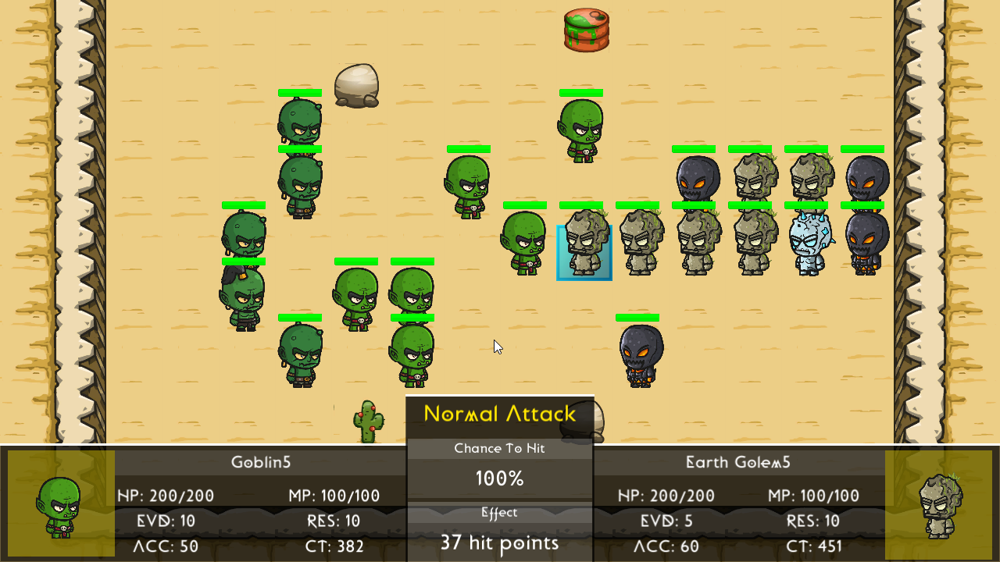
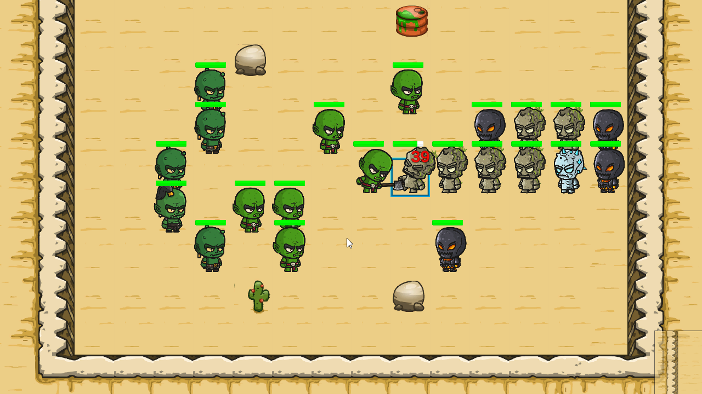
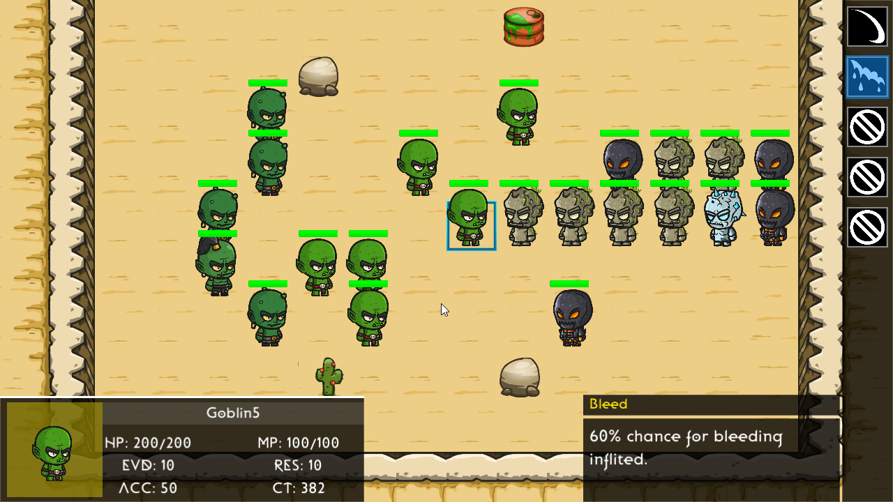
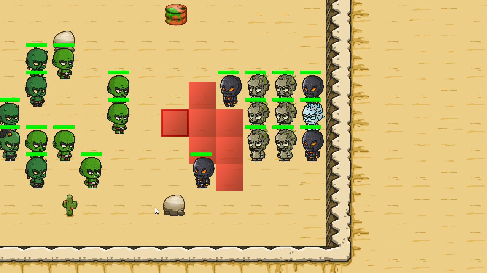
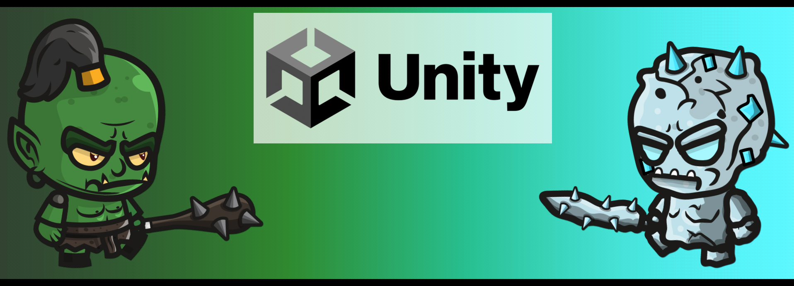
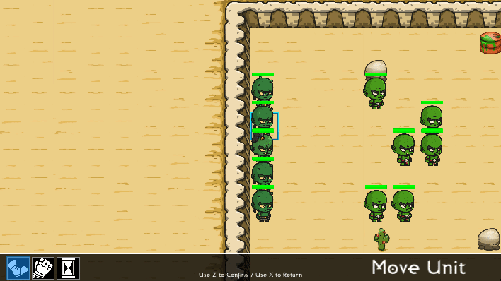

# Goblin Vs Golem

| [:rocket: Download](#download) | [:camera: Screenshots](#screenshots) |
| -------- | ----------- |

Goblin Vs Golem é um jogo eletrônico de táticas por turnos criado por mim. O Objetivo do jogo é derrotar todos os golem através de uma batalha no deserto.

## O que é o Goblin Vs Golem ?

É um projeto pessoal visando aprofundar o meu conhecimento em desenvolvimento de algoritmos, além de ganhar habilidades voltada a área de jogos. Fique a vontade para editar e usar o código!

Obs: Todas as artes usadas nesse jogo foram disponibilizadas gratuitamente por artistas independentes, sou responsável apenas pelo código.

| [Clique aqui para ver os créditos](#credits) |
| --------------- |

## Screenshots

  

  

  

  

## Download

Para jogar faça o download abaixo, extraia os arquivos e clique no arquivo "GoblinVsGolem"

<a href="https://github.com/williamss7435/goblin-vs-golem/raw/main/uploads/GoblinVsGolem.zip" download>Clique aqui para fazer o download do jogo</a>

## Gameplay e Detalhes
### Unity

  

Unity, é um motor de jogo proprietário criado pela Unity Technologies. Todo o projeto foi criado usando as ferramentas da unity na versão 2019.4.1

### Combate

  

  

O Combate é feito por turnos, cada unidade pode se mover, atacar e passar o turno. Enquanto a IA controla os  golens você comanda os Orc.

### Habilidades e Status

  

Cada unidade possui HP, MaxHP, MP, MaxMP, LVL, ATK, DEF, MATK, MDEF, ACC, EVD, RES, SPEED, MOV, além de um conjunto de habilidades.

### Movimentação e Habilidades

  

A movimentação é feita usando o algoritmo de dijkstra, quanto maior o MOV da unidade maior será o tamanho da amplitude do algoritmo.

### Inteligência Artificial

  

A inteligência artificial faz a escolha de movimento a partir das unidades próxima e escolhe um dos seus ataques aleatórios.

## Credits

O desenvolvimento de um jogo é um trabalho muito árduo, graças as esses artistas não precisei criar nenhuma imagem, música ou efeito.

The development of a game is a very hard work, thanks to these artists I didn't have to create any images, music or effects.

### Sprites

Free Orc, Ogre and Goblin Chibi 2D Game Sprites | https://craftpix.net  
https://craftpix.net/freebies/free-orc-ogre-and-goblin-chibi-2d-game-sprites/

Free Golem Chibi 2D Game Sprites | https://craftpix.net  
https://craftpix.net/freebies/free-golems-chibi-2d-game-sprites/

2D Character - Astronaut | https://assetstore.unity.com  
https://assetstore.unity.com/packages/2d/characters/2d-character-astronaut-182650  
Published By COPYSPRIGHT

700+ RPG Icons | https://opengameart.org  
https://opengameart.org/content/700-rpg-icons  
Published By Lorc

Cartoon FX Free | https://assetstore.unity.com  
https://assetstore.unity.com/packages/vfx/particles/cartoon-fx-free-109565  
Published By Jean Moreno

UI Pack | https://www.kenney.nl  
https://www.kenney.nl/assets/ui-pack  
Published By Kenney

### Music and Sound Effect

Fantasy Sfx | https://assetstore.unity.com  
https://assetstore.unity.com/packages/audio/sound-fx/fantasy-sfx-32833  
Published By Little Robot Sound Factory  
www.littlerobotsoundfactory.com

Gothic Dark by PeriTune | https://peritune.com/  
Music promoted by https://www.chosic.com/free-music/all/  
Creative Commons CC BY 4.0  
https://creativecommons.org/licenses/by/4.0/ 

Saga of Knight by Makai Symphony | https://soundcloud.com/makai-symphony  
Music promoted by https://www.chosic.com/free-music/all/  
Creative Commons CC BY-SA 3.0  
https://creativecommons.org/licenses/by-sa/3.0/ 

Epic Song by BoxCat Games | https://freemusicarchive.org/music/BoxCat_Games  
Music promoted by https://www.chosic.com/free-music/all/  
Creative Commons CC BY 3.0  
https://creativecommons.org/licenses/by/3.0/ 

### Tools

LeanTween | https://assetstore.unity.com  
https://assetstore.unity.com/packages/tools/animation/leantween-3595  
Published By Dented Pixel

